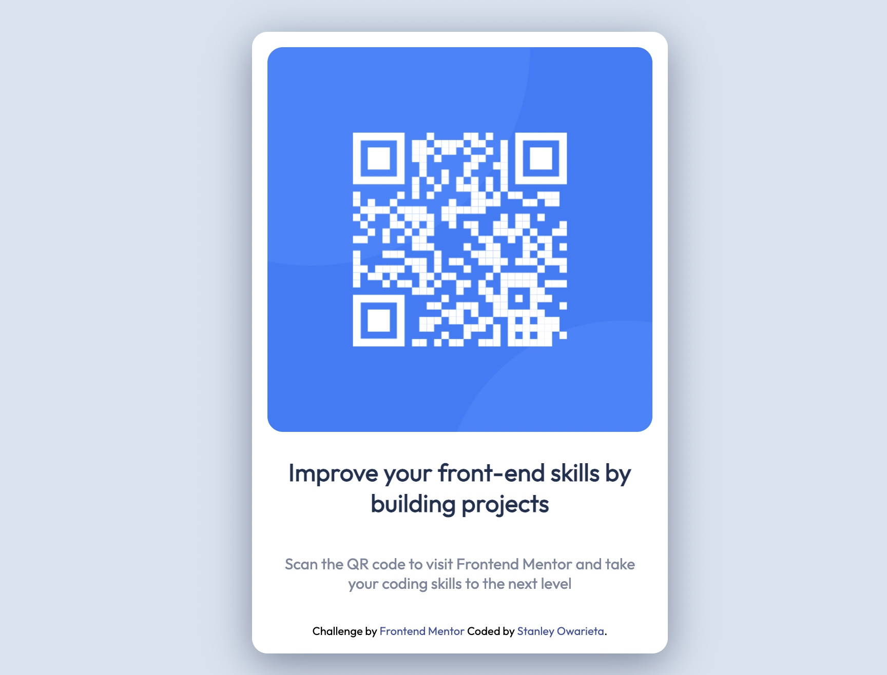

This is a solution to the [QR code component challenge on Frontend Mentor](https://www.frontendmentor.io/challenges/qr-code-component-iux_sIO_H). Frontend Mentor challenges help you improve your coding skills by building realistic projects. 

 ### Table of contents

- [Overview](#overview)
  - [Screenshot](#screenshot)
  - [Links](#links)
- [My process](#my-process)
  - [Built with](#built-with)
  - [Continued development](#continued-development)
- [Author](#author)

### Links

- Solution URL: [Click here](https://your-solution-url.com)

## My process

### Built with

- Semantic HTML5 markup
- CSS custom properties

### What I learned

With this project i've learned a little about Markdown and how it work the truth is that i have never heard of it before because i'm starting this career just recently and i'm proud of myself

### Continued development

I'm still on the learning prhase but i promise i'm deffinately going to focus more in CSS for styling my HTML designs and Java script for website functionality

### Useful resources

- [Markdown Guide](https://www.markdownguide.org/getting-started/) - Where i learn a bit about Markdown words and how to get started using it.
- [Dillinger](https://dillinger.io/) - This is a free website to preview your markdown

## Author

- Linkedin - [Stanley Owarieta](https://www.linkedin.com/in/stanley-owarieta-9127042b7/)
- Frontend Mentor - [Stanley24](https://www.frontendmentor.io/profile/Stanley-24)
- Github - [Stanley Owarieta](https://github.com/Stanley-24)

## Acknowledgments

Thanks to [Dr, Angela Yu](https://www.linkedin.com/in/angela-yu1/) for the amazing oppurtunity and for opening my eyes to a new path in my career, i'm pround to be among the 1M worldwide student learning your course and thanks to everyone out there putting in the work
